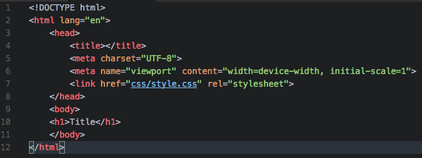
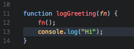
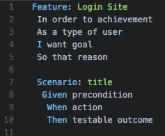

# DARK THEME 2.0
Dark Theme Customized and based on Atom's One Dark colors.

## INSTALLATION
ress `ctl/command + shift + p` to launch the command palette then run
```
ext install theme-darktheme2
```
## SCREENSHOT
Screenshot of HTML, JavaScript and Gherkin





**Enjoy!**